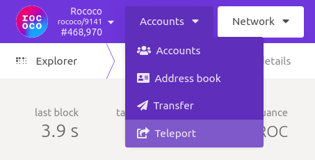
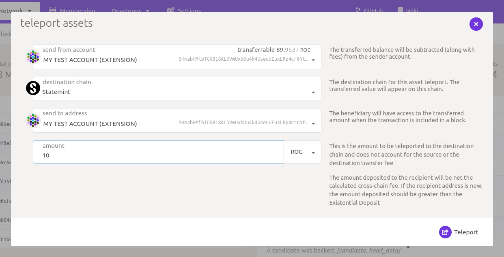

# Canvas ‒ A Smart Contracts Parachain

[![linux][a1]][a2] [![matrix][k1]][k2] [![discord][l1]][l2]

[a1]: https://gitlab.parity.io/parity/canvas/badges/master/pipeline.svg
[a2]: https://gitlab.parity.io/parity/canvas/pipelines?ref=master
[k1]: https://img.shields.io/badge/matrix-chat-brightgreen.svg?style=flat
[k2]: https://riot.im/app/#/room/#ink:matrix.parity.io
[l1]: https://img.shields.io/discord/722223075629727774?style=flat-square&label=discord
[l2]: https://discord.com/invite/wGUDt2p

This is a node implementation for Canvas, a [Substrate](https://github.com/paritytech/substrate)
parachain for smart contracts.

If you have any questions, feel free to talk to us on [Element][k2] or on [Discord][l2]
(in the [`ink_smart-contracts`](https://discord.com/channels/722223075629727774/765280480609828864) channel).

**Note:** This used to be a standalone smart contracts node used for the ink! workshop. We
have moved the standalone node to [substrate-contracts-node](https://github.com/paritytech/substrate-contracts-node/).


## Developing Smart Contracts for Canvas

<div align="center">
    
</div>

This node is based on the
[`cumulus/parachain-template`](https://github.com/paritytech/cumulus/tree/master/parachain-template),
which we configured to use Substrate's smart contracts module ‒ the [`contracts`](https://github.com/paritytech/substrate/tree/master/frame/contracts)
pallet.
This `contracts` pallet takes smart contracts as WebAssembly blobs and defines an API
for everything a smart contract needs (storage access, …).
As long as a programming language compiles to WebAssembly and there exists an implementation
of this API in it, you can write a smart contract for this pallet ‒ and thus for Canvas ‒ in
that language.

This is a list of languages you can currently choose from:

* [Parity's ink!](https://github.com/paritytech/ink) for Rust
* [ask!](https://github.com/patractlabs/ask) for Assembly Script
* The [Solang](https://github.com/hyperledger-labs/solang) compiler for Solidity

There are also different user interfaces and command-line tools you can use to deploy
or interact with contracts:

* [Canvas UI](https://paritytech.github.io/canvas-ui/)
* [polkadot-js](https://polkadot.js.org/apps/)

If you are looking for a quickstart, we can recommend
[ink!'s Guided Tutorial for Beginners](https://docs.substrate.io/tutorials/v3/ink-workshop/pt1/).

## Rococo Deployment

We have a live deployment of the Canvas parachain on Rococo ‒ a testnet for Polkadot and Kusama parachains.
You can access the network through Polkadot JS Apps,
[click here for a direct link to Canvas](https://polkadot.js.org/apps/?rpc=wss%3A%2F%2Frococo-canvas-rpc.polkadot.io#/explorer).

The Canvas parachain uses the Rococo relay chain's native token (ROC) instead of having its own token.
Due to this you'll need ROC in order to deploy contracts on Canvas.

As a first step, you should create an account. See [here](https://wiki.polkadot.network/docs/learn-account-generation)
for a detailed guide.
If using the Polkadot JS Apps extension, set your network preferences to "Allow use on
any network". This way your account will be usable under Rococo, as well as under Canvas.

As a second step, you have to get ROC testnet tokens through the [Rococo Faucet](https://wiki.polkadot.network/docs/learn-DOT#getting-rococo-tokens).
Once you have ROC tokens on Rococo, you'll need to teleport them from the
relay chain into the Canvas parachain.

Select "Accounts" > "Teleport" on [Rococo](https://polkadot.js.org/apps/?rpc=wss%3A%2F%2Frococo-rpc.polkadot.io#/explorer):



Select your account, set the destination chain to Canvas and specify the amount of ROC
you want to teleport:



If everything worked out, the teleported ROC tokens will show up under 
[the "Accounts" tab for Canvas](https://polkadot.js.org/apps/?rpc=wss%3A%2F%2Frococo-canvas-rpc.polkadot.io#/accounts).

Once you have ROC on Canvas you can deploy a contract as you would normally.
If you're unsure about this, our [guided tutorial](https://docs.substrate.io/tutorials/v3/ink-workshop/pt1/) 
will clarify that for you in no time.

As an endowment for our examples contracts 1-2 ROC tokens should do.

## Run it Locally

### Installation

You need to have executables of both Polkadot and Canvas.

Binary releases can be found here:
[Polkadot releases](https://github.com/paritytech/polkadot/releases),
[Canvas releases](https://github.com/paritytech/canvas/releases).

Alternatively you can install (or build) the projects yourself:

* `cargo install --git https://github.com/paritytech/polkadot.git --force --locked`
* `cargo install --git https://github.com/paritytech/canvas.git --force --locked`

The `--locked` flag makes the installation (or build) use the same versions as the `Cargo.lock`
in those repositories ‒ ensuring that the last known-to-work version of the dependencies is used.

### Launching

Starting this project is best done using the [`polkadot-launch`](https://github.com/paritytech/polkadot-launch) tool ‒
it starts Polkadot and registers the Canvas parachain on it automatically.

To use `polkadot-launch` you must ensure that you're using Node.js `v14.x` or newer. If
you're on macOS, you must also ensure that your machine's firewall is disabled. You can
do this by going to "System Preferences" > "Security & Privacy" > "Firewall" and ensuring
that it's off.

Now that you have the prerequisites:
1. Install it with `yarn global add polkadot-launch` or `npm i polkadot-launch -g`
1. Check that the paths in `polkadot-launch/config.json` point to the `polkadot` and `canvas` executables
1. Launch the network with `polkadot-launch polkadot-launch/config.json`

At this point you should be able to use [Polkadot JS Apps](https://polkadot.js.org/apps/)
to connect to the Polkadot relay chain nodes as well as the Canvas collator.

## Building from source

Follow the [official installation steps](https://docs.substrate.io/v3/getting-started/installation/)
to set up all Substrate prerequisites.

Afterwards you can install this node via

```bash
git clone https://github.com/paritytech/canvas.git
cd canvas/
cargo build --release --locked 
```

### Substrate Compatibility

The latest confirmed working Substrate commit which will then be used is
[0f070c8020fad552247fd4b43c1a6a4506e456b5](https://github.com/paritytech/substrate/commit/0f070c8020fad552247fd4b43c1a6a4506e456b5).

### Unstable Features

If you're the type of person that likes to drink your soup before it cools, you might
also be wondering about how to activate unstable `pallet-contracts` features. To do this
you can run the previous installation command with the following flag: 
`--features contracts-unstable-interface`.
